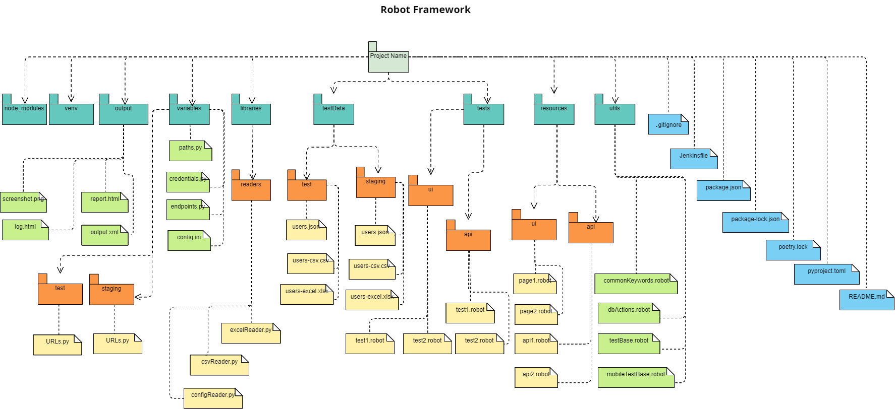

# Robot Framework 

*- This project is a base project to build a solid test automation framework using robot framework tool and python programming language.*

*- You can use this framework to be a start point for your test automation project to write your automated test cases.*

*- You can find more details in robot framework official website documentation:*
https://docs.robotframework.org/docs

## `Preparation:`

### A. Pre-requirements:

#### 1- Download and install latest python version through the below link
https://www.python.org/downloads/
        
#### 2- Download and install latest nodejs through the below link
https://nodejs.org/en/download

#### 3- Download and install pycharm or visual studo code throw the below links
https://www.jetbrains.com/pycharm/download/
https://code.visualstudio.com/download/

#### 4- Install poetry to manage libraries versions
        (Invoke-WebRequest -Uri https://install.python-poetry.org -UseBasicParsing).Content | py -

### B. Project readiness

#### 1- Clone the project

#### 2- Run the below command to install the required dependencies

        poetry install

#### 2- Run the below command to install the required allure dependency

        npm install

## `Features:`

### A. Usage of Robot Framework advantages:

#### 1- Example of test cases with screenshots
* Using robot framework keywords to capture screenshots

#### 2- Different types of reports configurations
* log.xml - output.xml - report.xml

#### 7- API tests
* Adding usable API URLs
* Applying api tests with different cases using simple examples

#### 8- Mobile test
* Applying simple mobile test example using Appium Library

#### 9- Tests examples
* Simple examples of test cases scripts using some options like "tags, variables, libraries ..."

### B. Extra features:

#### 1- Page Object Model design pattern
* Separating pages contents and keywords in different modules to enhance readability and maintainability

#### 2- Project structure adjustment to modules
* Dividing the project into modules according to its functionality and usage

#### 3- Using data driven framework
* Separating test data to external files to enhance readability and maintainability
* Reading from different types of files (json format, csv and excel sheets)

#### 4- Parallel execution
* Using pabot library to run tests in parallel

#### 5- Running in different environments
* Adding an option to pass the environment value through CLI
* Adjustment of the baseURL in code and config file according to the running environment
* Adjustment of different data files according to the running environment

#### 6- Database connection
* Adding a usable module for mysql DB connection using database and pymysql libraries

#### 7- Handling different languages
* Adding a simple technique to run the test cases in different language
* Adding an option to pass the language through CLI

#### 8- Poetry
* Adding poetry library to handle libraries versioning

#### 9- Allure report
* Adding allure report with more analytics and charts options to enhance readability and visibility to the test report

## `Contents:`

### A. Folders and directories:

#### 1- tests/:
* All FE and API test cases scripts

#### 2- resources/:
* All FE pages and keywords
* General used request bodies, params and headers for APIs

#### 3- test-data/:
* All test data files with different types (json format, csv and excel sheets)

#### 4- libraries/readers/:
* All test data readers for different file types (csv, excel, config.ini ...)

#### 5- variables/:
* URLs.py: base URL for every environment
* paths.py: paths and directories for used files
* endpoints.py: all routs and api endpoints for API tests
* credentials.py: database credentials and secrets
* config.ini: configuration file

#### 6- utils/:
* commonKeywords.robot: general implementation for used keywords and assertions in different modules
* dbActions.robot: configurations and keywords needed for mysql database connection
* testBase.robot: general running configuration and browser launch keywords for web testing
* mobileTestBase.css: general running configuration and app launch keywords for mobile testing

#### 7- output/:
* Robot Framework report data
* Screenshots
* Other needed reports

#### 8- node_modules/:
* All downloaded libraries and modules for allure report

#### 9- venv/:
* All downloaded libraries and modules for the project

### B. Project configuration files:

#### 1- pyproject.toml:
* All Installed dependencies

#### 2- poetry.lock:
* Details of all Installed dependencies

#### 3- package.json:
* Allure Installed dependency

#### 4- package-lock.json:
* Allure detailed Installed dependency

#### 5- .gitignore:
* All files and folders that needs to be excluded from pushing to the version control

#### 6- Jenkinsfile:
* Configurations and commands for installing playwright and running tests in Jenkins pipeline

## `How to run?`

### A. Running normal test cases:

#### 1- Use direct command as below:

        robot {testFolder/filePath}

#### 2- Run test cases in parallel:

        pabot {pathToTests}

#### 3- To pass the used environment or language you can use the below bash command:

        robot -d output -v TestEnvironment:test -v Headless:false -v Language:en {testsPath}

### B. Generating/ Opening Allure report:

#### 1- Generate the report:

        npx allure generate {report path} -o {generation path} --clean

#### 2- Open the report:

        npx allure open {generated report path}

## `Project Structure:`
*The below is a package diagram for the implemented project structure "Files and folders"*

## `General instructions and guidelines:`

* Specify files and tags that should be run according to business group and testing needs

* Configure URLs, endpoints, credentials and paths for test environment, secrets and used language

* Every test should have its representative name

* Resources files should hold locators, strings and common keywords for the pages which represent actions and assertions

* It is recommended to collect common keywords inside commonKeywords.robot file

* Files and folders should be named with this format {firstWordSecondWord..} (Camel case)

* Variables and words start with capital letters as recommended approach

* Write locators, scenario steps and tests in the order of the page under test

* Do not assert on existence of a certain element if we will assert on its text

* Do not write any keyword if you will not use it

* For every api we create tests in test file and general used bodies, headers and params under resources directory

* Test cases modules include commonKeywords.robot as a resource

* commonKeyword.robot module includes testBase.robot as a resource

#### *`Notes:`*
* *It is not recommended to depend on allure report as you will need an extra effort beside losing some report features in the report however Robot Framework report is very powerful*
